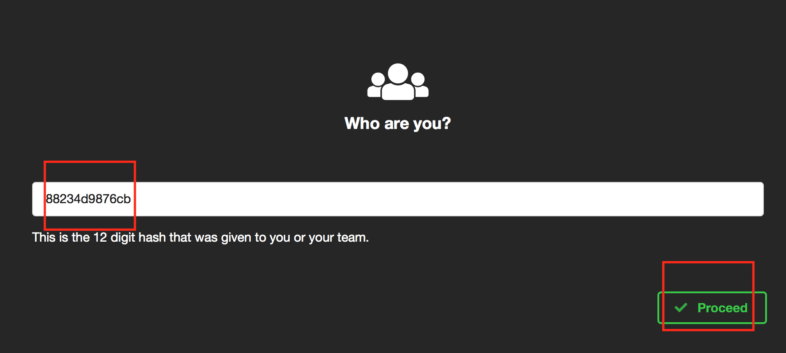
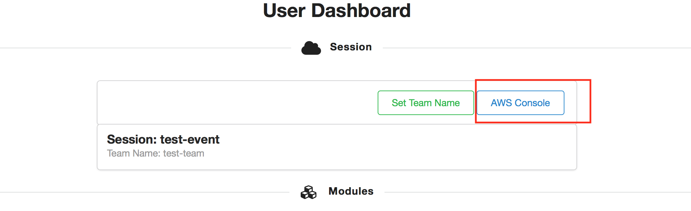
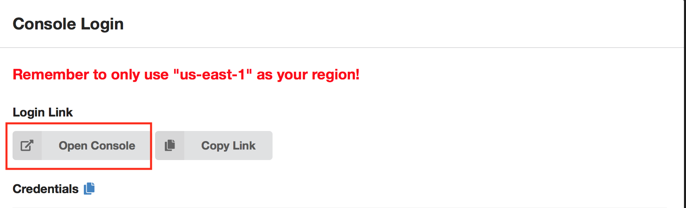
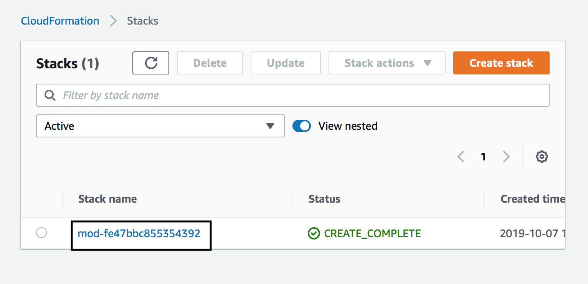
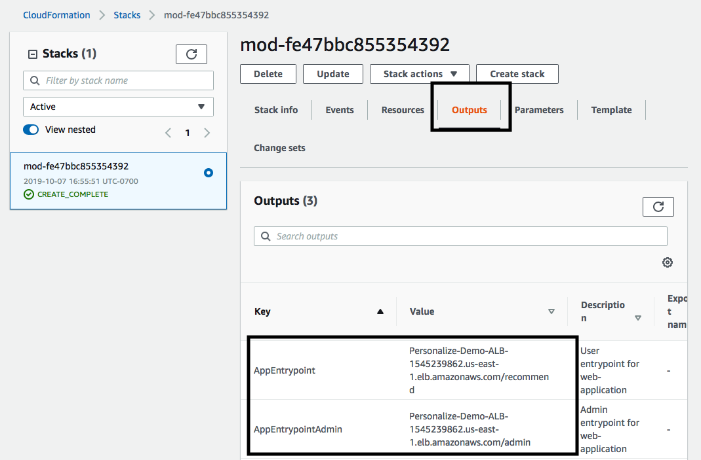
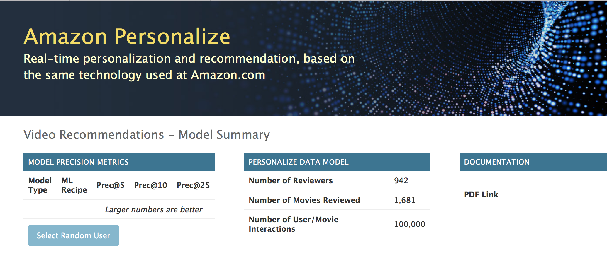
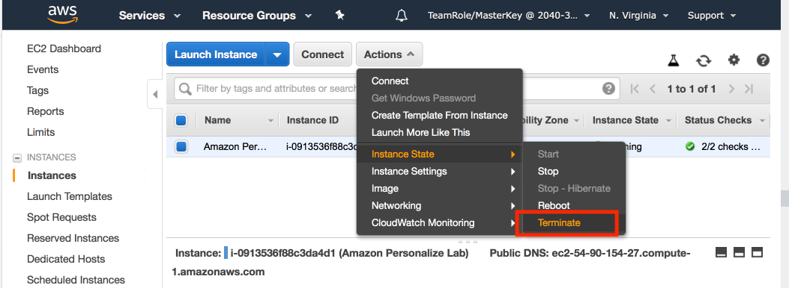
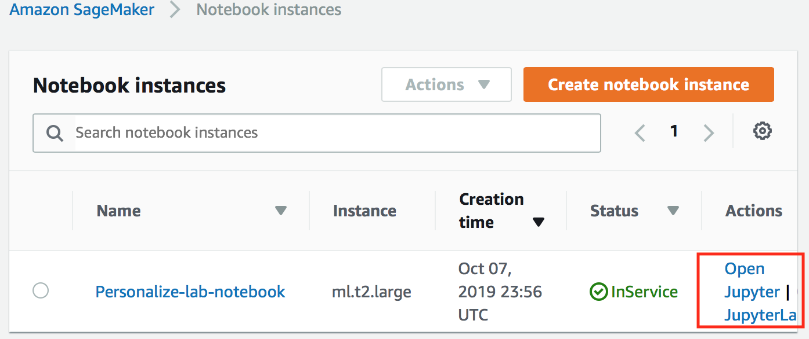
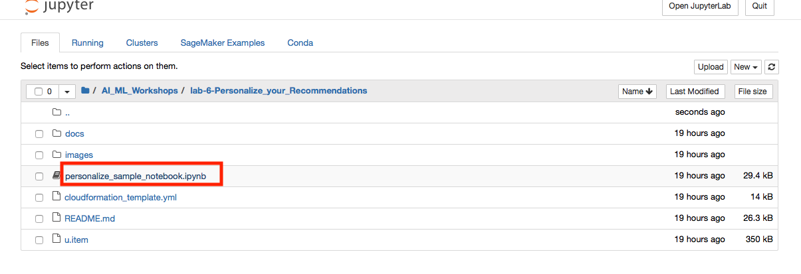

    
**Last Updated:** September 2019

# Personalize Your Recommendations

## Overview

Amazon Personalize is a machine learning service that makes it easy for developers to create individualized recommendations for customers using their applications.

Machine learning is being increasingly used to improve customer engagement by powering personalized product and content recommendations, tailored search results, and targeted marketing promotions. However, developing the machine-learning capabilities necessary to produce these sophisticated recommendation systems has been beyond the reach of most organizations today due to the complexity of developing machine learning functionality. Amazon Personalize allows developers with no prior machine learning experience to easily build sophisticated personalization capabilities into their applications, using machine learning technology perfected from years of use on Amazon.com.

This lab will walk you through the following:

- Get your AWS account hash and login via console.
- Launch SageMaker Notebook instance for the Amazon Personalize Service 
- Downloading and preparing training data, based on the Movie Lens 100k data set
- Importing prepared data into Amazon Personalize
- Building an ML model based upon the Hierarchical Recurrent Neural Network algorithm (HRNN)
- Testing your model by deploying an Amazon Personalize campaign
- Adding your campaign to Video Recommendation application

**Note: We have secured accounts with some pre-provisioned infrastructure necessary for the lab and using us-east-1 region for the entire lab work.**
# Get your AWS account hash and login via console

1. Get account hash from the instructor, then right click and open the following link in new tab: [event link](https://dashboard.eventengine.run)

2. Click *AWS Console* in top right corner in the following screeen

3. Then click *Open Console* to open AWS Console.

3. Right click and open the following link in new tab to open CloudFormation page:[link](https://console.aws.amazon.com/cloudformation/home?region=us-east-1#/stacks?filteringText=&filteringStatus=active&viewNested=true&hideStacks=false)

4. On Stacks Page, click on the stack hyperlink of the stack that begins with name *mod-*

5. Click outputs tab and make a note of key values of AppEntrypoint and AppEntryPointAdmin which will be used later in this lab.

6. Open the AppEntrypoint in browser to make sure the app is working fine.

**Note: if you see 502 bad gateway click [link](https://console.aws.amazon.com/ec2/home?region=us-east-1#Instances:sort=instanceId) and recycle the instance with the name *"Amazon Personalize Lab"* as shown below**

  Due to an unknown bug the app doesnt work fine during the first deployment sometimes but recycling the instance always helps.

# Launch pre-provisioned Sagemaker notebook instance

1. Open the [link](https://console.aws.amazon.com/sagemaker/home?region=us-east-1#/notebook-instances) to locate pre-provisioned notebook instances

2. Launch the Sagemaker notebook Jupyter of the instance with name *Personalize-lab-notebook*

3. From the page that opened lauch personalize notebook as shown below

### Working Through a Jupyter Notebook

1. A notebook consisted of a number of cells; in SageMaker these will typically either be _Code_ or _Markdown_ cells.  Markdown is used to allow for documentation to be defined inline with the code, giving the author a rich set of markdown formatting options.  The first cell in this notebook, which is called **Get the Personalize boto3 Client**, is Markdown, and if you select any cell then the whole cell is highlighted.

2. The first Markdown cell describes what the following Code cell is going to do – for the sake of this lab you do not have to understand the code that is being run in the Code cell, rather you should just appreciate what the notebook is doing and how you interact with a Jupyter notebook.

3. To the left of a Code module is a set of empty braces **[ ]**.  By highlighting the cell and then selecting the _Run_ command in the menu bar, the Jupyter notebook will execute this code, outputting and code outputs to the notebook screen and keeping any results data internally for re-use in future steps.  Do this now to execute the first code cell.

*Note: if a Markdown cell is highlighted, then clicking **Run** will move the highlight to the next cell*

3. Whilst the code is executing the braces will change to be **[\*]**, indicating that it is executing, and once complete will change to **[1]**.  Future cells will have increasing numbers inside the braces, and this helps you see the order in which cells have been exected within the notebook.  Directly below the code, but still within the Code cell, is the output from the code execution - this will include any error messages that your code has thrown.  In this example, the code execurion successfully created the specified bucket in S3.

5. Now please continue to work through the notebook lab - read the comments prior to each Code cell in order to get an understanding as to what is going on, as these explain why we are doing each step and how it ties in to using the Amazon Personalize service.

# Creating Parallel Solutions

## Create Item-to-Item Similarities Solution and Personal Ranking Solution

1. You can create the Item-to-Item Similarities Solution and Personal Ranking Solution using a jupyter notebook or via AWS console, but we are skipping this part due to time constraints.

## Running the Video Recommendation App

1.  The application server should already running running.  You can find the two URLs required for different aspects of the app in the CloudFormation outputs panel.

   
   
2. The URL of the application is your ALB followed by the **/recommend/** path, although there is also an **/admin/** path configured that we'll use later.  For now connect to your application using the *AppEntrypoint* URL

3. You should see the following screen in your browser - no *Model Precision Metrics* are available, as we haven't added any models yet to the application.  You can also see that documentation for this is present, but be aware that it may not be 100% up to date with coding changes on the demo.

   

4. If you hit **Select Random User** then you'll be taken to the main Recommendation screen, which starts by showing you a random user's top-25 movie review titles.  However, you'll see on the Model dropdown on the left that there are no models available, and if you change the Personalize Mode to either Personal Ranking or Similar Items then it's the same story - you can see the movie reviews, and most-popular titles in a genre, but no recommendations.  We need to get the solutions and campaigns built in the notebook, then you can come back and plug in the models.

   

At this point we require the solution that is being built in the notebook to complete and the associated campaign to have been created - until that time we cannot move forward.

## Plug In the Recommendation Model(s)

The application uses the Django Administration feature to define models that are available to the application.  This allows multiple models of different types to be configured, and injected or removed from the application at any time.  There are three modes of operation of the application:

- **Recommendations** - standard recommendations, allowing different 2 models to be compared at once
- **Personal Ranking** - re-ranks popular films in a genre, with a single model on-screen at once
- **Similar Items** - shows items similar to others, with a single model on-screen at once.  You can optionally send this list through a *Personal Ranking* model if you have one defined

Each of these modes allows multiple models of their type to be used, but each mode can only show one or two different models simultaneously - however, you can choose any configured model at any time.

1. Login to the Django Administration site.  This is at the same URL as the main application, but replace **/recommend** with **/admin** at the end of the URL, as shown previously in the CloudFormation Outputs panel.  This will bring up the following screen, so login now with the credentials that you supplied when you ran the CloudFormation template:

   
   
3. This brings up the *Site Administration* screen, which show entries for Groups and Users (which we don't need), but also a section called **Recommend** where you can add **Personalize models** to the app.  Click on **+Add** link to begin to add a new model

4. Back on the AWS Console, go to the **Amazon Personalize** service console, select the **personalize-recs-dataset-group** and then on the left-hand menu click **Campaigns**.  This will show your **personalize-lab-recs-campaign**.  If you've created all three then you should see something like this, but for your other two campaigns may already have been created

   

5. Click on the **personalize-lab-recs-campaign** and you'll see the **Campaign ARN** - copy this, and head back to the admin screen.  Enter **Personal Recommendations** for the model name, enter the ARN where it asks, ensure that the **Model type** is set for recommendations and set the **Model sort order** to 1.  Click on **SAVE** to save the definition.

   

6. The application will use the sort order field to decide how to order models in the on-screen drop-downs.  Only models of the right type are shown on the relevant screen, but there is no validation that you have entered the correct model type, and if you put a SIMS model on the Rankings screen then the application will throw errors.

7. If you also have a SIMS or Personal Ranking campaign then go ahead and add them now in the same way - if they haven't yet completed then you can come back and add them later.  You can then close the admin screen and head back to the main application web page

8. The main screen now shows the three models (or maybe just one) that we've built - it lists the precision metrics for each one, and as you add or remove models from the Django Administration page the changes will be reflected here.  Now click on the **Select Random User** button

   

9. The screen will look as before, but now if you click on the **Model 1** drop-down you will see that our one Recommendation model is present - if you select it then the screen will refresh to show recommendations for this user using that model.

   

10. You can step through users to see how these look for different demographics of users.  If you had mutiple Recommendation models defined then they would also be in the two model drop-downs, and you'd be able to show two completely different recommendation models, based upon different user demographic or item metadata, allowing you to compare and contrast different approaches.

11. Try out the **Personal Ranking** personalize mode - this takes a list of the most popular movies in the dataset, either as a whole or in just a single genre.  This will take that list and re-rank it into an order for this particular user, ensuring that the ones that are most likely to be interested in are shown first.

12. Finally, try the **Similar Items** personalize mode - this starts with the user's top-ranked film, and finds a list of films that people who watched this also watched.  This is done without reference to the user's preferences, and the list is generated based upon what's in the dataset as a whole.  However, if you also have a **Personal Ranking** model defined then the **Ordering** drop-down will re-rank this list into one that is more suited to the user's preferences.

## Additional Campaigns to Build

If you look at the embedded documentation you'll see that it talks about 3 other models, which there isn't time to build during this Lab.  They involve the user of additional data files - a user demographic file, and a item metadata file, all of which are supplied with the Movie Lens data set in your Sagemaker Notebook.  Because they required additional data-sets, you need to create each of these within their own Personalize Dataset Group, and you also need to re-import the original interactions file **DEMO-movie-lens-100k.csv** that you uploaded into S3 during the notebook - this is because Personalize trains solutions on all data files witin the Dataset Group.

The three models that you should build are as follows:

- Using a USERS file, create a model that takes into account user's demographic details such as age, gender and occupation
- Using an ITEMS metadata file, create a model that also takes into account the movie year and the top-4 genres associated with that movie as 4 separate metadata fields
- Using an ITEMS metadata file, create a model that also takes into account the movie year and then compounds the top-4 genres into a single metadata field

Observations are that demographics are absolutely not a good indicator for movies recommendations, nor for things like book recommendations - this isn't an issue with Amazon Personalize, rather it is a know issue with using age and gender to predict likes and dislikes of media.  Also, the single, compound genre certainly seems more accurate for the first 5 or 10 responses, but for the set of 25 response as a whole the multiple genre model probably gets a better list of movies than the compound one.

## Conclusion

Upon completion of this lab you will have performed the following:

- Launched a Jupyter notebook from with the Amazon SageMaker service
- Imported external files into the notebook environment
- Seen how to enable Preview services within a notebook (assuming your account has been whitelisted for Preview access)
- Used the **pandas** libraries to do some pre-processing of the source data
- Built and deployed an ML model based upon the HRNN algorithm
- Tested your model via just a few lines of code
- Deployed your model into a live application

You should now be able to embed this model from within your own application code, using any language that is supported by the AWS SDK.  Happy recommending!
